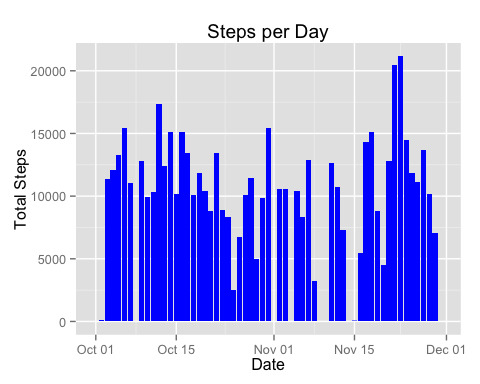
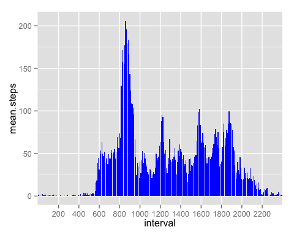
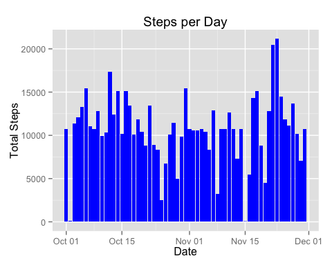
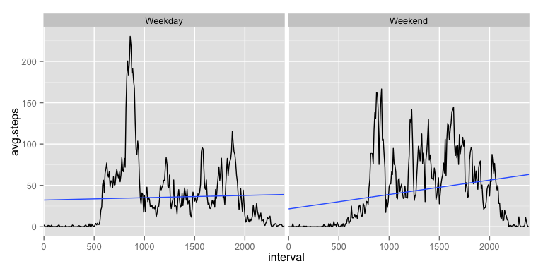

# Reproducible Research: Peer Assessment 1
## Load needed libraries

```r
library("dplyr")
library("ggplot2")
```

## Loading and preprocessing the data

```r
if( ! file.exists("activity.zip"))
    download.file("https://d396qusza40orc.cloudfront.net/repdata%2Fdata%2Factivity.zip",file="activity.zip")

if(! file.exists("activity.csv")) 
    unzip("activity.zip")

rawData <- read.csv("activity.csv",header=T,na.strings = "NA")
rawData <- tbl_df(rawData)

rawData$date <- as.Date(rawData$date,format="%Y-%m-%d")
rawData$interval <- as.factor(rawData$interval)
```

## What is mean total number of steps taken per day?
Create a summary table with the total steps 

```r
totalSteps <- summarise(group_by(rawData,date),total.steps=sum(steps,na.rm=T))
```
The mean total number of steps taken per day is 9354  

## What is the average daily activity pattern?

The following graph shows a histogram of the total number of steps taken each day. 

```r
totalSteps <- summarise(group_by(rawData,date),total.steps=sum(steps,na.rm=T))

g <- ggplot(totalSteps,aes(x=date,y=total.steps)) + geom_histogram(stat="identity",fill="blue")
g + xlab("Date") + ylab("Total Steps") + ggtitle("Steps per Day")
```

 

The median steps per day is 10395. The mean steps per day is 9354.

### What is the average daily activity pattern?
The following is a time series plot of the 5-minute interval (x-axis) and the average number of steps taken, averaged across all days (y-axis).

```r
meanStepsByInt <- summarize(group_by(rawData,interval),mean.steps=mean(steps,na.rm = T))
g<- ggplot(meanStepsByInt,aes(x=interval,y=mean.steps))
g<- g + geom_histogram(stat="identity",fill="blue")
g + scale_x_discrete(breaks=seq(200,3000,200))
```

 

The 5-minute interval, on average across all the days in the dataset, containing the maximum number of steps is 835

## Inputing missing values
The data is missing 2304 rows with NA values. 

1. The missing values are substituted with the mean of data the interval. If a value is NA, we substitue the
value with the average of the other values at the same interval

```r
mutate(group_by(rawData,interval),avgByIntvl=mean(steps,na.rm=T)) -> rawData
rawData$fixed.steps <- ifelse(is.na(rawData$steps),rawData$avgByIntvl,rawData$steps)

# Cleanup data
#rawData$steps <- NULL
rawData$avgByIntvl <- NULL
#colnames(rawData)[colnames(rawData) == "fixed.steps"] <- "steps"

totalSteps2 <- summarise(group_by(rawData,date),total.steps.fixed=sum(fixed.steps))

g <- ggplot(totalSteps2,aes(x=date,y=total.steps.fixed)) + geom_histogram(stat="identity",fill="blue")
g + xlab("Date") + ylab("Total Steps") + ggtitle("Steps per Day")
```

 

The following table shows the mean and median with/without the filled in values. 

```r
fixed.data <- c(as.integer(mean(totalSteps2$total.steps.fixed)),as.integer(median(totalSteps2$total.steps.fixed)))
orig.data <- c(as.integer(mean(totalSteps$total.steps)),as.integer(median(totalSteps$total.steps)))
tbl_x <- data.frame(rbind(orig.data,fixed.data))
colnames(tbl_x)<- c("mean","median")
print(tbl_x)
```

```
##             mean median
## orig.data   9354  10395
## fixed.data 10766  10766
```
This shows that filling the missing value increases both the mean and median but not significantly.


## Are there differences in activity patterns between weekdays and weekends?

```r
rawData$weekday <- ifelse(weekdays(rawData$date) %in% c('Saturday','Sunday'),'Weekend','Weekday')
as.factor(rawData$weekday) -> rawData$weekday

# Create a new table based on the avg of mean steps taken on each day
avgSteps <- summarise(group_by(rawData,interval,weekday),avg.steps=mean(fixed.steps))

g <- ggplot(avgSteps,aes(interval,avg.steps)) + facet_grid(.~weekday)
g <- g + geom_line(aes(group=1)) + scale_x_discrete(breaks=seq(0,5000,500))
g + geom_smooth(aes(group=1),method="lm",se=FALSE)
```

 

The graphs show that while the steps on a per-interval basis is almost flat on a weekday, it appears to to increase as the day progresses on the weekend. 
